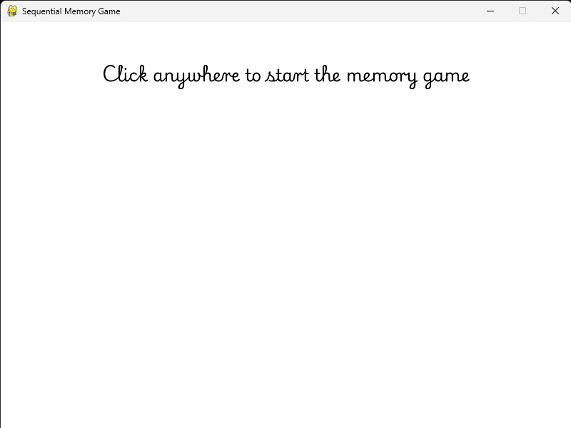
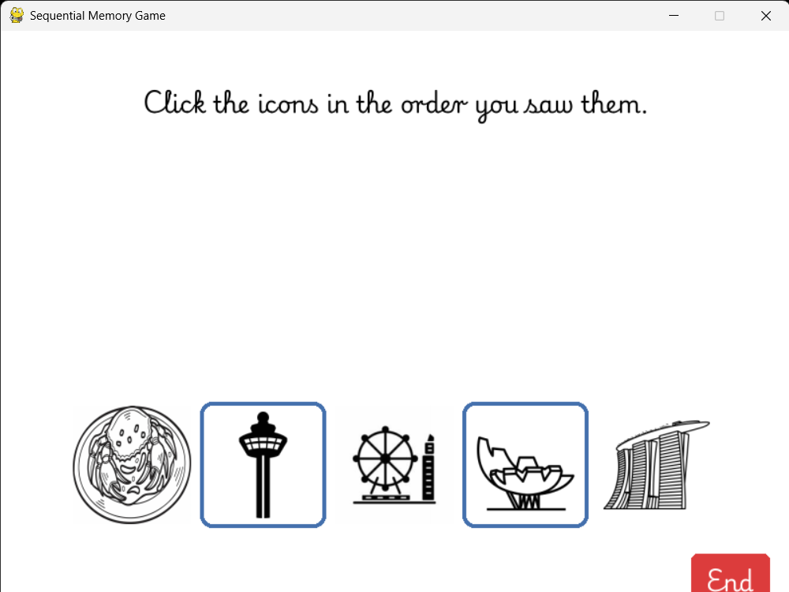

# 🧠 Sequential Memory Game [Dementia-Friendly Edition]

A Pygame-based prototype designed to support **working and episodic memory** in older adults with mild Alzheimer's dementia. This game helps users recall the order of visual sequences while enjoying familiar cultural icons and MRT jingles from Singapore.

---

## 🧪 Cognitive & Emotional Focus

This game combines:
- ✅ **Cognitive stimulation therapy** (sequential memory recall)
- ✅ **Reminiscence therapy** (familiar Singaporean imagery and sound)
- ✅ **Minimal caregiver intervention** via a clear, simple UI

---

## 🕹️ How It Works

1. Players are shown a short sequence of **3 icons** one after another.
2. After the sequence disappears, they must **click the icons in the correct order**.
3. The game gives **instant feedback** and resets after each round.

Background MRT jingles (e.g. *Chan Mali Chan*) play throughout, offering an emotionally comforting and familiar atmosphere.

---

## 📷 Preview

<table>
  <tr>
    <td></td>
    <td></td>
    <td></td>
  </tr>
</table>

---

## 📦 Setup

### ✅ 1. Clone the repo

```bash
git clone https://github.com/lucyy05/01.020_DTP_III_v2.git
cd 01.020_DTP_MemoryGame
````

### ✅ 2. Create a virtual environment (optional)

```bash
python -m venv venv
```

Activate it:

* Windows:

  ```bash
  venv\Scripts\activate
  ```
* Mac/Linux:

  ```bash
  source venv/bin/activate
  ```

### ✅ 3. Install dependencies

```bash
pip install -r requirements.txt
```

### ✅ 4. Run the game

```bash
python sequential_memory.py
```

---

## 📁 Folder Structure

```
01.020_DTP_MemoryGame/
│
├── assets/                 # Game icons and MRT jingles
│   ├── mrt_jingle.mp3
│   ├── [icon_name].png
│   └── Playwrite.ttf
│
├── media/                  # Screenshots for README/docs
│   ├── seq_start.png
│   ├── seq_memory.png
│   └── seq_recall.png
│
├── sequential_memory.py    # Main game script
├── requirements.txt        # Python dependencies
├── README.md               # Project overview
└── .gitignore              # Git exclusions
```

---

## 💡 Features

* Local cultural imagery: **Merlion, MRT, Marina Bay Sands**, etc.
* MRT background jingles for emotional stimulation
* Large, accessible buttons and clean layout
* Click feedback and visual highlights
* Ability to **deselect** and correct choices before submission

---

## 🧬 Neuroscience Behind the Game

This game targets early-declining brain functions in Alzheimer's:

| Brain Region             | Function                            |
| ------------------------ | ----------------------------------- |
| 🧠 **Hippocampus**       | Episodic memory, spatial sequencing |
| 🧠 **Prefrontal Cortex** | Decision-making, working memory     |

Studies show that structured memory tasks combined with reminiscence elements can **slow decline** and **promote neuroplasticity** in dementia care.